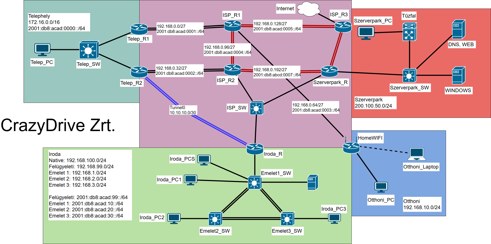

# Cisco-Project-CrazyDriveZrt
Complex enterprise network project including VLANs, VTP, EtherChannel, STP, OSPF (IPv4/IPv6), HSRP and GRE tunnel. Configured Cisco devices, ASA firewall (NAT), Linux &amp; Windows servers (AD, DNS, DHCP). Automated backups using Python (Netmiko).

## Documentation

- Full project presentation: docs/Bemutato.pptx

 ## Network Topology

